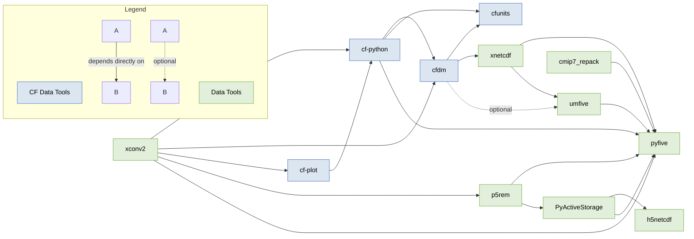

# NCAS-CMS Libraries Depedencies Tracker

⚠️ Warning: this dependencies graph is manually created and will not auto-update, so must be
kept in sync.

```mermaid
flowchart LR

    %% ============================================================
    %% CF Data Tools
    %% ============================================================

    cfpython["cf-python"]
    cfdm["cfdm"]
    cfplot["cf-plot"]
    cfunits["cfunits"]

    %% ============================================================
    %% Data Tools
    %% ============================================================

    pyfive["pyfive"]
    pyactivestorage["PyActiveStorage"]
    xnetcdf["xnetcdf"]
    xconv2["xconv2"]
    cmip7_repack["cmip7_repack"]
    umfive["umfive"]
    p5rem["p5rem"]
    h5netcdf["h5netcdf"]

    %% ============================================================
    %% Dependencies
    %% Solid arrow = direct dependency
    %% Dotted arrow = optional dependency
    %% ============================================================

    cfpython --> cfdm
    cfpython --> cfunits
    cfpython --> pyfive

    cfdm --> cfunits
    cfdm --> xnetcdf
    cfdm -.->|optional| umfive

    cfplot --> cfpython

    pyactivestorage --> h5netcdf
    pyactivestorage --> pyfive

    xnetcdf --> pyfive
    xnetcdf --> umfive

    xconv2 --> cfpython
    xconv2 --> cfdm
    xconv2 --> cfplot
    xconv2 --> p5rem
    xconv2 --> pyfive

    cmip7_repack --> pyfive

    umfive --> pyfive

    p5rem --> pyfive
    p5rem --> pyactivestorage

    %% ============================================================
    %% Category colours
    %% ============================================================

    classDef cf fill:#DCE6F1,stroke:#4472C4,color:#000
    classDef data fill:#E2EFDA,stroke:#70AD47,color:#000

    class cfpython,cfdm,cfplot,cfunits cf
    class pyfive,pyactivestorage,xnetcdf,xconv2,cmip7_repack,umfive,p5rem,h5netcdf data

    %% ============================================================
    %% Visible legend
    %% ============================================================

    subgraph LEGEND["Legend"]
        direction TB

        legend_cf["CF Data Tools"]
        legend_data["Data Tools"]

        legend_a["A"]
        legend_b["B"]

        legend_a -->|depends directly on| legend_b

        legend_optional_a["A"]
        legend_optional_b["B"]

        legend_optional_a -.->|optional| legend_optional_b

        class legend_cf cf
        class legend_data data
    end
```
